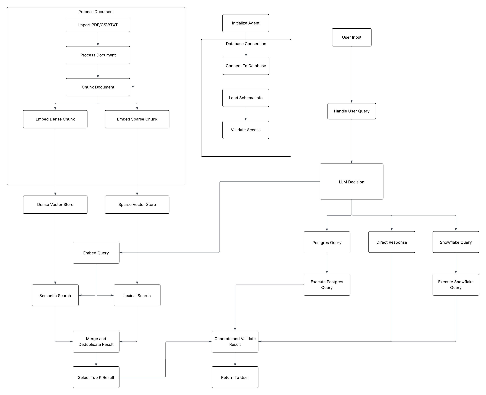

# AI Agent Documentation

## Overview

The AI Agent is an intelligent assistant built using **LangGraph** and **LangChain** that provides access to multiple data sources through a tool-calling architecture. It features **human-in-the-loop (HITL)** approval for tool execution, enabling users to review and approve tool calls before they are executed.

### Key Features

- 🤖 **Multi-Tool Integration**: Access to Snowflake, PostgreSQL, and RAG document search
- ✅ **Human-in-the-Loop (HITL)**: Review and approve tool execution before running (enabled by default)
- 🔄 **Hybrid Search**: Advanced RAG with semantic + lexical search and reranking
- 📊 **Multi-Tool Response Summary**: Structured analysis of multiple tool responses
- 🔧 **LangGraph StateGraph**: Robust workflow orchestration with conditional routing

---

## Architecture



### Workflow Components

The agent follows a state-based graph architecture:

1. **START** → User submits query
2. **llm_call** → LLM decides which tools to use (if any)
3. **Conditional Routing**:
   - If tools needed + HITL enabled → **approval** node
   - If tools needed + HITL disabled → **tools** node
   - If no tools needed → **END**
4. **approval** → Human reviews and approves/rejects tool execution
5. **tools** → Execute approved tools
6. **Loop back** to llm_call for final response synthesis
7. **END** → Return final answer to user

### State Management

The agent uses `MessagesState` to maintain conversation context:
```python
MessagesState = {
    "messages": List[BaseMessage]  # Conversation history
}
```

Message types:
- **HumanMessage**: User input
- **AIMessage**: LLM responses (with optional tool_calls)
- **ToolMessage**: Tool execution results
- **SystemMessage**: System prompts and instructions

---

## Available Tools

### 1. Snowflake Tools

#### `get_all_product_categories_from_snowflake()`
- **Purpose**: Retrieve all unique product categories
- **Arguments**: None
- **Returns**: List of product categories with SQL query and row count
- **Example**:
  ```json
  {
    "sql_used": "SELECT DISTINCT product_category_name_english FROM ...",
    "row_count": 15,
    "rows": [{"product_category_name_english": "electronics"}, ...]
  }
  ```

#### `get_product_by_category_from_snowflake(category: str)`
- **Purpose**: Get one example product from a specific category
- **Arguments**: 
  - `category` (str): Product category name (e.g., 'electronics', 'health_beauty')
- **Returns**: Single product details
- **Example**:
  ```json
  {
    "sql_used": "SELECT * FROM ... WHERE product_category_name_english = 'electronics' LIMIT 1",
    "row_count": 1,
    "row": {"product_id": "123", "product_name": "Laptop", ...}
  }
  ```

#### `get_order_summary_by_quarter_from_snowflake(year: int, quarter: int)`
- **Purpose**: Get order summary statistics for a specific year and quarter
- **Arguments**: 
  - `year` (int): Year (e.g., 2023)
  - `quarter` (int): Quarter (1-4)
- **Returns**: Order statistics including count, revenue, avg value
- **Example**:
  ```json
  {
    "sql_used": "SELECT COUNT(*), SUM(revenue), AVG(value) FROM ...",
    "row_count": 1,
    "row": {"order_count": 1500, "total_revenue": 250000, "avg_order_value": 166.67}
  }
  ```

### 2. PostgreSQL Tools

#### `get_latest_product_summary_from_postgre()`
- **Purpose**: Get the latest ingested product event from PostgreSQL
- **Arguments**: None
- **Returns**: Most recent product data from real-time ingestion
- **Example**:
  ```json
  {
    "sql_used": "SELECT * FROM products ORDER BY created_at DESC LIMIT 1",
    "row_count": 1,
    "row": {"product_id": "456", "timestamp": "2026-01-03T12:00:00", ...}
  }
  ```

### 3. RAG Document Search Tools

#### `hybrid_search_documents(query: str, top_k: int = 3, alpha: float = 0.5)`
- **Purpose**: Advanced hybrid search combining semantic + lexical search with reranking
- **Arguments**: 
  - `query` (str): Search query
  - `top_k` (int): Number of results to return (default: 3)
  - `alpha` (float): Weight for dense vs sparse (0.0-1.0, default: 0.5)
    - 0.0 = pure keyword matching (sparse/BM25)
    - 0.5 = balanced hybrid
    - 1.0 = pure semantic (dense embeddings)
- **Process**:
  1. **Dense Search**: Semantic similarity using embeddings
  2. **Sparse Search**: Lexical matching using BM25+
  3. **Merge**: Combine results from both indexes
  4. **Filter**: Keep only documents found in BOTH searches (high confidence)
  5. **Rerank**: Calculate hybrid scores and reorder
  6. **Return**: Top K results
- **Returns**: Hybrid search results with scores
- **Example**:
  ```json
  {
    "query": "Fiona",
    "search_method": "hybrid_search",
    "total_merged_results": 4,
    "top_k": 3,
    "alpha": 0.5,
    "results": [
      {
        "rank": 1,
        "hybrid_score": 0.7083,
        "dense_score": 0.308,
        "sparse_score": 5.0588,
        "content": "e asleep. Shrek turns and goes over to her...",
        "source": "Shrek_script.txt",
        "chunk_id": "chunk_0149_Shrek"
      }
    ]
  }
  ```

#### `search_documents(query: str, top_k: int = 3)` (Legacy)
- **Purpose**: Simple semantic-only search (legacy method)
- **Arguments**: 
  - `query` (str): Search query
  - `top_k` (int): Number of results (default: 3)
- **Returns**: Semantic search results
- **Note**: Use `hybrid_search_documents` for better quality results

---

## Human-in-the-Loop (HITL) Feature

### Overview

The HITL feature allows users to review and approve tool execution before the agent runs them. This provides:
- **Transparency**: See exactly which tools will be called and with what arguments
- **Control**: Approve or reject tool execution
- **Safety**: Prevent unwanted or expensive operations

### Default Behavior

**HITL is ENABLED by default** in both CLI and interactive modes.

### Usage

#### Enabling HITL (Default)
```bash
# HITL enabled by default - no flag needed
uv run ./ai-agent/core/cli_interface_tool_calling.py
```

#### Disabling HITL
```bash
# Use --no-hitl to disable
uv run ./ai-agent/core/cli_interface_tool_calling.py --no-hitl
```

### Approval Flow

When tools are ready to execute, you'll see:

```
============================================================
🔔 TOOL APPROVAL REQUIRED
============================================================

The agent wants to execute 2 tool(s):

  1. 🔧 Tool: hybrid_search_documents
     📝 Arguments:
        • query: Fiona
        • top_k: 3

  2. 🔧 Tool: get_all_product_categories_from_snowflake
     📝 Arguments: (none)


🤔 Approve execution? (yes/y to approve, no/n to reject):
```

**Response Options**:
- Type `yes` or `y` → Tools execute
- Type `no` or `n` → Execution rejected, agent receives rejection message

### Tool Execution Summary (Multiple Tools)

When multiple tools execute, you'll see:

```
============================================================
📊 TOOL EXECUTION RESULTS
============================================================

🔧 Tool 1: hybrid_search_documents
------------------------------------------------------------
{
  "query": "Fiona",
  "search_method": "hybrid_search",
  "total_merged_results": 4,
  "top_k": 3,
  "results": [...]
}

🔧 Tool 2: get_all_product_categories_from_snowflake
------------------------------------------------------------
{
  "sql_used": "SELECT DISTINCT product_category_name_english FROM ...",
  "row_count": 15,
  "rows": [...]
}

============================================================
📋 SUMMARY OF ALL TOOL RESPONSES
============================================================
Total tools executed: 2
✅ Successful: 2

Brief overview:
  1. ✅ hybrid_search_documents: {'query': 'Fiona', 'search_method': 'hybrid_search'...
  2. ✅ get_all_product_categories_from_snowflake: {'sql_used': 'SELECT DISTINCT...
============================================================
```

---

## LLM Response Format (Multiple Tools)

When multiple tools are used, the LLM provides a structured analysis:

```
Tool 1 Response: hybrid_search_documents
Based on the search results, Fiona is a character from Shrek who appears 
in several key scenes including the rescue scene and the transformation moment...

Tool 2 Response: get_all_product_categories_from_snowflake  
The Snowflake database contains 15 unique product categories including 
electronics, books, clothing, health_beauty, and more...

SUMMARY:
Your query requested two different types of information. The document search 
found character details about Fiona from Shrek (with high relevance scores), 
while the database query retrieved all available product categories from our 
catalog. These results provide both the character information you asked about 
and the complete list of product categories.
```

---

## Usage Examples

### CLI Interface

#### Starting the Agent
```bash
# With HITL (default)
uv run ./ai-agent/core/cli_interface_tool_calling.py

# Without HITL
uv run ./ai-agent/core/cli_interface_tool_calling.py --no-hitl
```

#### Interactive Mode
```bash
# With HITL (default)
uv run python ai-agent/core/tool_calling_agent.py interactive

# Without HITL
uv run python ai-agent/core/tool_calling_agent.py interactive --no-hitl
```

### Example Queries

#### Document Search
```
Query: "Tell me about Fiona from Shrek"
Tools Used: hybrid_search_documents
Result: Character information from Shrek script with relevance scores
```

#### Database Query
```
Query: "What product categories are available?"
Tools Used: get_all_product_categories_from_snowflake
Result: List of 15+ unique product categories
```

#### Multi-Tool Query
```
Query: "Search for Fiona and show me all product categories"
Tools Used: 
  1. hybrid_search_documents
  2. get_all_product_categories_from_snowflake
Result: Combined analysis with individual responses + summary
```

#### Time-Based Query
```
Query: "Show me order summary for Q4 2023"
Tools Used: get_order_summary_by_quarter_from_snowflake(year=2023, quarter=4)
Result: Order statistics with count, revenue, and average values
```

---

## Implementation Details

### Technology Stack

- **LangGraph**: State graph orchestration
- **LangChain**: Tool integration and message handling
- **OpenAI**: LLM for decision making and response generation
- **Pinecone**: Vector database for RAG (dense + sparse indexes)
- **Snowflake**: Data warehouse queries
- **PostgreSQL**: Real-time data ingestion

### Key Files

```
ai-agent/
├── core/
│   ├── tool_calling_agent.py          # Main agent implementation
│   ├── cli_interface_tool_calling.py  # CLI interface
│   └── streamlit_tool_calling_app.py  # Streamlit UI (if available)
├── tools/
│   ├── snowflake_tools.py             # Snowflake data queries
│   ├── postgre_tools.py               # PostgreSQL queries
│   ├── rag_tools.py                   # Legacy semantic search
│   └── rag_combined_tools.py          # Hybrid search (dense + sparse)
└── rag/
    ├── embed_and_store.py             # Document embedding pipeline
    ├── sparse_embedder.py             # BM25+ sparse embeddings
    └── text_chunking.py               # Document chunking logic
```

### Configuration

The agent uses environment variables (`.env`):

```bash
# OpenAI Configuration
OPENAI_API_KEY=your_api_key
OPENAI_MODEL=gpt-3.5-turbo  # or gpt-4

# Pinecone Configuration
PINECONE_API_KEY=your_pinecone_key
PINECONE_ENVIRONMENT=your_env
PINECONE_INDEX_NAME=your_dense_index
PINECONE_SPARSE_INDEX_NAME=your_sparse_index

# Snowflake Configuration
SNOWFLAKE_USER=your_user
SNOWFLAKE_PASSWORD=your_password
SNOWFLAKE_ACCOUNT=your_account
SNOWFLAKE_WAREHOUSE=your_warehouse
SNOWFLAKE_DATABASE=your_database
SNOWFLAKE_SCHEMA=your_schema

# PostgreSQL Configuration
POSTGRES_HOST=localhost
POSTGRES_PORT=5432
POSTGRES_DB=your_db
POSTGRES_USER=your_user
POSTGRES_PASSWORD=your_password
```

---

## Testing

### Run Test Cases
```bash
uv run python ai-agent/core/tool_calling_agent.py test
```

### Visualize Workflow
```bash
uv run python ai-agent/core/tool_calling_agent.py visualize
```

This generates a Mermaid diagram of the agent's workflow graph.

---

## Best Practices

### Tool Selection

1. **Document Search**: Always use `hybrid_search_documents` for better quality
   - Character names (Fiona, Donkey)
   - Movie/book titles (Shrek, BeeMovie)
   - General document content

2. **Database Queries**: Use specific Snowflake tools
   - Product data → `get_product_by_category_from_snowflake`
   - Categories → `get_all_product_categories_from_snowflake`
   - Order analytics → `get_order_summary_by_quarter_from_snowflake`

3. **Latest Data**: Use PostgreSQL tool
   - Real-time ingestion → `get_latest_product_summary_from_postgre`

### Human-in-the-Loop

- **Keep HITL enabled** for production/important queries
- **Review tool arguments** carefully before approval
- **Use --no-hitl** only for testing or trusted workflows

### Multi-Tool Queries

- LLM automatically provides structured analysis with individual tool responses + summary
- Review the summary section for comprehensive insights
- Each tool's output is analyzed separately before synthesis

---

## Troubleshooting

### Common Issues

1. **Tool Approval Timeout**: Type `yes` or `no` when prompted
2. **Connection Errors**: Check environment variables and network access
3. **Empty Results**: Verify data exists in the queried source
4. **API Rate Limits**: Reduce query frequency or upgrade OpenAI plan

### Debug Mode

The agent includes detailed state printing for debugging:
- Shows state before each node
- Displays tool calls and arguments
- Logs execution flow

Look for `Step: Before LLM Call` and `Step: Before Tool Execution` in output.

---

## Future Enhancements

- [ ] Add more data source connectors
- [ ] Implement conversation memory/persistence
- [ ] Add tool usage analytics
- [ ] Support for file uploads
- [ ] Multi-modal inputs (images, PDFs)
- [ ] Custom tool creation interface
- [ ] Scheduled/automated queries

---

## References

- [LangGraph Documentation](https://python.langchain.com/docs/langgraph)
- [LangChain Tools](https://python.langchain.com/docs/modules/agents/tools/)
- [Pinecone Hybrid Search](https://docs.pinecone.io/docs/hybrid-search)
- [OpenAI API](https://platform.openai.com/docs/api-reference)
