# 🏗️ Capstone Project Architecture

## 📊 System Overview

This data engineering capstone project implements a comprehensive music analytics pipeline that demonstrates modern data engineering practices through a multi-layered architecture supporting both batch and real-time processing.

> **📚 Foundation**: This architecture builds on [data engineering fundamentals](data-engineering-fundamentals.md) - the core building blocks of Sources → Ingestion → Storage → Transformation → Analysis.

## 🌐 Architecture Philosophy

Our system follows the **ELT (Extract, Load, Transform)** pattern, answering the five fundamental data engineering questions:

1. **Where does data come from?** → Music APIs (Last.fm, Spotify) + Kaggle datasets
2. **How does it move?** → Python collectors + Airflow orchestration
3. **Where do we store it?** → PostgreSQL (staging) + Snowflake (analytics)
4. **How do we process it?** → dbt transformations + SQL modeling
5. **How do we use it?** → AI recommendations + Analytics dashboards

## 🎯 Design Principles

### OLTP vs OLAP Strategy
- **PostgreSQL (OLTP)**: Fast transactions, normalized schema for staging + validation
- **Snowflake (OLAP)**: Analytical queries, aggregations, history for dashboards & BI

### Batch vs Real-Time Processing
- **Batch**: Daily music data collection and model training
- **Real-Time**: < 2 seconds recommendation response time
- **Hybrid**: Batch learning with real-time inference

## 🏗️ 8-Layer Architecture

```mermaid
graph TD
    subgraph "🌍 DATA SOURCES"
        A1[Last.fm API]
        A2[Spotify API] 
        A3[Kaggle Datasets]
    end
    
    subgraph "📥 INGESTION LAYER"
        B1[Python API Collectors]
        B2[Batch Processors]
        B3[Error Handling]
    end
    
    subgraph "🗃️ STAGING LAYER"
        C1[PostgreSQL Local]
        C2[JSON File Storage]
        C3[Data Validation]
    end
    
    subgraph "☁️ CLOUD STORAGE"
        D1[Snowflake RAW]
        D2[Data Lake]
        D3[Time Travel]
    end
    
    subgraph "🔧 TRANSFORMATION"
        E1[dbt Models]
        E2[SQL Cleaning]
        E3[Business Logic]
    end
    
    subgraph "📊 ANALYTICS LAYER"
        F1[Snowflake ANALYTICS]
        F2[Dimensional Models]
        F3[ML Features]
    end
    
    subgraph "🤖 AI LAYER"
        G1[Recommendation Engine]
        G2[Content Filtering]
        G3[Collaborative Filtering]
    end
    
    subgraph "📱 PRESENTATION"
        H1[REST APIs]
        H2[Analytics Dashboard]
        H3[User Interface]
    end
    
    A1 --> B1
    A2 --> B1
    A3 --> B2
    
    B1 --> C1
    B2 --> C2
    B3 --> C3
    
    C1 --> D1
    C2 --> D2
    
    D1 --> E1
    E1 --> E2
    E2 --> E3
    
    E3 --> F1
    F1 --> F2
    F2 --> F3
    
    F3 --> G1
    G1 --> G2
    G2 --> G3
    
    G3 --> H1
    H1 --> H2
    H2 --> H3
```

## 🔄 ELT Data Flow

### Extract Phase
- **Music APIs**: Real-time data collection with rate limiting
- **Kaggle Datasets**: Batch historical data processing
- **Error Handling**: Fallback mechanisms and retry logic

### Load Phase
- **PostgreSQL**: Local staging with ACID compliance
- **Snowflake RAW**: Cloud storage with auto-scaling
- **Data Validation**: Quality checks before transformation

### Transform Phase
- **dbt Models**: SQL-first transformation approach
- **Dimensional Modeling**: Star schema for analytics
- **ML Feature Engineering**: Prepared data for AI models

## 🛠️ Technology Stack Alignment

| Layer | Technology | Purpose | Design Decision |
|-------|------------|---------|----------------|
| **Sources** | Last.fm API, Spotify API, Kaggle | Music data origin | Multi-source redundancy |
| **Ingestion** | Python 3.10+, httpx, requests | Data collection | Rich ecosystem for APIs |
| **Staging** | PostgreSQL, Docker | Local development | OLTP for fast transactions |
| **Cloud Storage** | Snowflake | Scalable warehouse | OLAP for analytics |
| **Transformation** | dbt, SQL | Data modeling | SQL-first approach |
| **Analytics** | Snowflake ANALYTICS | Business intelligence | Dimensional modeling |
| **AI/ML** | Python, scikit-learn | Recommendations | Best-in-class ML ecosystem |
| **Orchestration** | Apache Airflow | Pipeline management | Industry standard |

## 📊 Success Metrics Implementation

### Data Pipeline Health
- **Batch Processing**: < 30 minutes daily pipeline
- **Data Quality**: > 95% completeness and accuracy
- **Error Rate**: < 1% failed API calls
- **Storage Efficiency**: Optimized for query performance

### AI System Performance
- **Response Time**: < 2 seconds recommendation latency
- **Scalability**: 1000+ concurrent users
- **Accuracy**: > 90% recommendation relevance
- **Coverage**: 6+ genres, 1000+ artists

## 🔒 Quality & Governance

### Data Validation
- **Schema Validation**: Enforce data contracts
- **Completeness Checks**: Monitor missing values
- **Freshness Monitoring**: Track data arrival times
- **Anomaly Detection**: Identify data quality issues

### Security & Compliance
- **API Key Management**: Secure credential storage
- **Data Privacy**: User data protection
- **Access Control**: Role-based permissions
- **Audit Trails**: Track data lineage

This architecture demonstrates industry-standard data engineering practices while maintaining simplicity and focus on learning outcomes for the capstone project.