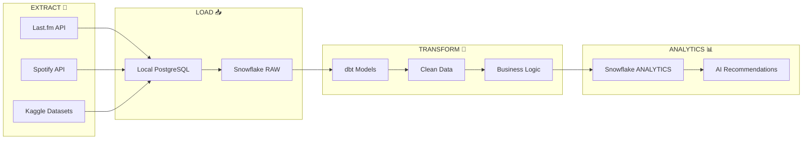

# 🔄 Data Flow Documentation

## 📋 Overview

This document explains the simple **ELT (Extract, Load, Transform)** data flow for our **AI Music Recommender Agent**. We follow a straightforward pattern: get data from sources, load it into storage, then transform it for analytics.

## 🌊 Simple ELT Flow



## 🎯 Step-by-Step Data Journey

### Step 1: EXTRACT 📡
**What**: Get raw music data from various sources

**Sources**:
- **Last.fm API**: User listening history, track info
- **Spotify API**: Song features, artist details  
- **Kaggle Datasets**: Historical music data

**Tools**: Python API collectors, requests library, kagglehub

### Step 2: LOAD 📥
**What**: Store raw data without changing it

**Local Storage** (Development):
- **PostgreSQL**: For local development and testing
- **JSON Files**: Raw API responses saved as-is

**Cloud Storage** (Production):
- **Snowflake RAW Database**: All raw data, exactly as received

**Tools**: PostgreSQL, Snowflake, COPY commands, Python connectors

### Step 3: TRANSFORM 🔧
**What**: Clean and structure data for business use

**Transformations**:
- **Data Cleaning**: Fix missing values, standardize formats
- **Business Logic**: Calculate metrics, create relationships
- **Data Modeling**: Create tables for analytics

**Tools**: dbt (data build tool), SQL, Jinja templating

### Step 4: ANALYTICS 📊
**What**: Ready-to-use data for AI and reporting

**Final Destination**:
- **Snowflake ANALYTICS Database**: Clean, structured data
- **AI Features**: Data ready for machine learning
- **Dashboards**: Data for business reporting

**Tools**: Snowflake, Python ML libraries, BI tools

## 🔄 Complete ELT Pipeline

### Development Flow (Local)
```
API/Kaggle → Python Scripts → PostgreSQL → Validate → Ready for Cloud
```

### Production Flow (Cloud)
```
Raw Data → Snowflake RAW → dbt Transform → Snowflake ANALYTICS → AI Model
```

## 📁 Data Storage Structure

### Raw Layer (Unchanged Data)
```
RAW.MUSIC.TRACKS          -- Last.fm track data
RAW.MUSIC.ARTISTS         -- Artist information  
RAW.MUSIC.USER_HISTORY    -- User listening data
RAW.SPOTIFY.FEATURES      -- Spotify audio features
```

### Analytics Layer (Cleaned Data)
```
ANALYTICS.MUSIC.DIM_TRACKS     -- Clean track information
ANALYTICS.MUSIC.DIM_ARTISTS    -- Artist master data
ANALYTICS.MUSIC.FCT_PLAYS      -- User listening facts
ANALYTICS.MUSIC.RECOMMENDATIONS -- AI recommendation results
```

## 🔄 Data Flow Process Overview

### 1. Extract Music Data
**Process**: Collect raw music data from external sources
**Technologies**: Python API collectors, Kaggle downloaders
**Output**: Raw JSON files and API responses

### 2. Load to Databases
**Process**: Store raw data without modification
**Technologies**: 
- **Local**: PostgreSQL (development)
- **Cloud**: Snowflake (production)
**Output**: Raw data tables with original structure

### 3. Transform with dbt
**Process**: Clean and structure data for business use
**Technologies**: dbt (data build tool)
**Activities**: 
- Remove duplicates
- Standardize formats
- Create business logic
- Build dimensional models

### 4. Analytics Ready Data
**Process**: Serve clean data for AI and reporting
**Technologies**: Snowflake ANALYTICS database
**Output**: Structured tables ready for ML models

## ✅ Quality Checks & Monitoring

### Data Validation
**What**: Ensure data quality at each stage
**Technologies**: SQL queries, Python validators, dbt tests
**Checks**: 
- Data freshness (daily arrivals)
- Completeness (< 5% missing values)
- Consistency (no duplicates)

### Error Handling
**What**: Handle failures gracefully
**Technologies**: Python retry logic, Airflow alerts
**Strategy**: 
- Retry failed API calls
- Use backup data sources
- Alert on critical failures

### Pipeline Monitoring
**What**: Track pipeline health
**Technologies**: Airflow monitoring, Snowflake queries
**Metrics**: 
- Data arrival times
- Processing duration
- Error rates
- Recommendation response time

## 📈 Success Metrics

**Data Pipeline Health**:
- ✅ Data arrives daily
- ✅ Less than 5% missing values
- ✅ Processing completes within 30 minutes
- ✅ Zero data corruption

**AI System Performance**:
- ✅ Recommendations respond in < 2 seconds
- ✅ Support 1000+ concurrent users
- ✅ 95%+ recommendation accuracy

This simple ELT pattern ensures reliable data flow from music APIs to AI recommendations, using proven technologies and straightforward processes!