# 🔄 Data Flow Documentation

## 📋 Overview

This document explains the simple **ELT (Extract, Load, Transform)** data flow for our **AI Music Recommender Agent**. We follow the foundational data engineering pattern of answering five key questions:

1. **Where does data come from?** → Music APIs + Datasets
2. **How does it move?** → Python collectors + orchestration
3. **Where do we store it?** → PostgreSQL (staging) + Snowflake (analytics)
4. **How do we process it?** → dbt transformations + SQL
5. **How do we use it?** → AI recommendations + dashboards

> **📚 Foundation**: This flow implements the core building blocks from [data engineering fundamentals](data-engineering-fundamentals.md).

## 🌊 Simple ELT Flow

```mermaid
graph LR
    subgraph "EXTRACT 📡"
        A1[Last.fm API]
        A2[Spotify API]
        A3[Kaggle Datasets]
    end
    
    subgraph "LOAD 📥"
        B1[PostgreSQL Staging]
        B2[Snowflake RAW]
    end
    
    subgraph "TRANSFORM 🔧"
        C1[dbt Models]
        C2[Clean Data]
        C3[Business Logic]
    end
    
    subgraph "ANALYTICS 📊"
        D1[Snowflake ANALYTICS]
        D2[AI Recommendations]
    end
    
    A1 --> B1
    A2 --> B1
    A3 --> B1
    
    B1 --> B2
    B2 --> C1
    C1 --> C2
    C2 --> C3
    C3 --> D1
    D1 --> D2
```



## 🎯 Step-by-Step Data Journey

### Step 1: EXTRACT 📡
**What**: Get raw music data from various sources

**Sources** (Answering: "Where does data come from?"):
- **Last.fm API**: User listening history, track info
- **Spotify API**: Song features, artist details  
- **Kaggle Datasets**: Historical music data

**Tools**: Python API collectors, requests library, kagglehub
**Pattern**: Multi-source strategy with fallback mechanisms

### Step 2: LOAD 📥
**What**: Store raw data without changing it (ELT approach)

**Local Storage** (Development):
- **PostgreSQL**: OLTP for local development and testing
- **JSON Files**: Raw API responses saved as-is

**Cloud Storage** (Production):
- **Snowflake RAW Database**: OLAP for all raw data, exactly as received

**Tools**: PostgreSQL, Snowflake, COPY commands, Python connectors
**Pattern**: Stage locally, then load to cloud for scalability

### Step 3: TRANSFORM 🔧
**What**: Clean and structure data for business use (Transform in warehouse)

**Transformations**:
- **Data Cleaning**: Fix missing values, standardize formats
- **Business Logic**: Calculate metrics, create relationships
- **Data Modeling**: Create dimensional models for analytics

**Tools**: dbt (data build tool), SQL, Jinja templating
**Pattern**: SQL-first transformations in cloud warehouse

### Step 4: ANALYTICS 📊
**What**: Ready-to-use data for AI and reporting

**Final Destination**:
- **Snowflake ANALYTICS Database**: Clean, structured data
- **AI Features**: Data ready for machine learning
- **Dashboards**: Data for business reporting

**Tools**: Snowflake, Python ML libraries, BI tools
**Pattern**: Serve analytics-ready data for consumption

## 🔄 Complete ELT Pipeline

### Development Flow (Local - OLTP Pattern)
```
API/Kaggle → Python Scripts → PostgreSQL Staging → Validate → Ready for Cloud
```
**Why PostgreSQL**: Fast transactions, ACID compliance, perfect for staging

### Production Flow (Cloud - OLAP Pattern)
```
Raw Data → Snowflake RAW → dbt Transform → Snowflake ANALYTICS → AI Model
```
**Why Snowflake**: Auto-scaling, pay-per-use, optimized for analytics

### Batch vs Real-Time Processing
- **Batch**: Daily data collection and model training (minutes-hours)
- **Real-Time**: Live recommendation responses (seconds-ms)
- **Hybrid**: Best of both - batch learning with real-time inference

## 📁 Data Storage Structure

### Raw Layer (Unchanged Data)
```
RAW.MUSIC.TRACKS          -- Last.fm track data
RAW.MUSIC.ARTISTS         -- Artist information  
RAW.MUSIC.USER_HISTORY    -- User listening data
RAW.SPOTIFY.FEATURES      -- Spotify audio features
```

### Analytics Layer (Cleaned Data)
```
ANALYTICS.MUSIC.DIM_TRACKS     -- Clean track information
ANALYTICS.MUSIC.DIM_ARTISTS    -- Artist master data
ANALYTICS.MUSIC.FCT_PLAYS      -- User listening facts
ANALYTICS.MUSIC.RECOMMENDATIONS -- AI recommendation results
```

## 🔄 Data Flow Process Overview

### 1. Extract Music Data (Sources)
**Process**: Collect raw music data from external sources
**Technologies**: Python API collectors, Kaggle downloaders
**Output**: Raw JSON files and API responses
**Design Pattern**: Multi-source strategy with fallback mechanisms

### 2. Load to Databases (Ingestion & Storage)
**Process**: Store raw data without modification (ELT approach)
**Technologies**: 
- **Local (OLTP)**: PostgreSQL for development and staging
- **Cloud (OLAP)**: Snowflake for production analytics
**Output**: Raw data tables with original structure
**Design Pattern**: Local-to-cloud pipeline with validation

### 3. Transform with dbt (Transformation)
**Process**: Clean and structure data for business use
**Technologies**: dbt (data build tool), SQL transformations
**Activities**: 
- Remove duplicates and handle missing values
- Standardize formats and create business logic
- Build dimensional models (star schema)
- Generate ML features

### 4. Analytics Ready Data (Analysis & Output)
**Process**: Serve clean data for AI and reporting
**Technologies**: Snowflake ANALYTICS database, Python ML libraries
**Output**: Structured tables ready for ML models and dashboards
**Design Pattern**: Dimensional modeling for analytics consumption

## ✅ Quality Checks & Monitoring

### Data Validation
**What**: Ensure data quality at each stage
**Technologies**: SQL queries, Python validators, dbt tests
**Checks**: 
- Data freshness (daily arrivals)
- Completeness (< 5% missing values)
- Consistency (no duplicates)

### Error Handling
**What**: Handle failures gracefully
**Technologies**: Python retry logic, Airflow alerts
**Strategy**: 
- Retry failed API calls
- Use backup data sources
- Alert on critical failures

### Pipeline Monitoring
**What**: Track pipeline health
**Technologies**: Airflow monitoring, Snowflake queries
**Metrics**: 
- Data arrival times
- Processing duration
- Error rates
- Recommendation response time

## 📈 Success Metrics

**Data Pipeline Health**:
- ✅ Data arrives daily
- ✅ Less than 5% missing values
- ✅ Processing completes within 30 minutes
- ✅ Zero data corruption

**AI System Performance**:
- ✅ Recommendations respond in < 2 seconds
- ✅ Support 1000+ concurrent users
- ✅ 95%+ recommendation accuracy

This simple ELT pattern ensures reliable data flow from music APIs to AI recommendations, using proven technologies and straightforward processes!