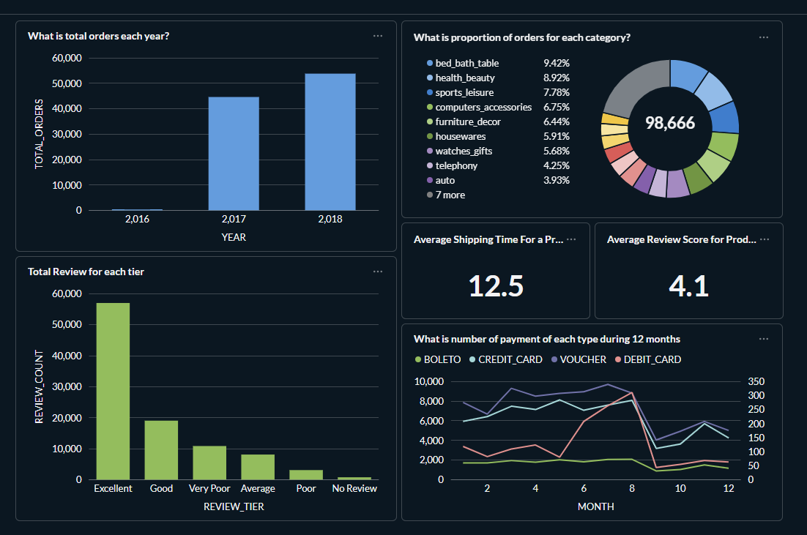

# Fact Dashboard

This folder contains documentation and assets for the **Fact Dashboard** built in Metabase.

## Dashboard Overview

The Fact Dashboard provides key business metrics and visualizations for the e-commerce dataset. It is designed to give stakeholders a quick, high-level view of orders, product categories, customer reviews, shipping performance, and payment trends.



---

## Visualizations

### 1. Total Orders by Year (Bar Chart)
- **Metric:** `TOTAL_ORDERS`
- **Dimension:** `YEAR`
- **Insight:** Shows year-over-year order volume growth from 2016 to 2018. Orders increased significantly each year, with 2018 having the highest volume (~54,000 orders).

### 2. Proportion of Orders by Category (Donut Chart)
- **Metric:** Percentage of total orders (98,666 total)
- **Dimension:** `PRODUCT_CATEGORY`
- **Top Categories:**
  | Category               | Share   |
  |------------------------|---------|
  | bed_bath_table         | 9.42%   |
  | health_beauty          | 8.92%   |
  | sports_leisure         | 7.78%   |
  | computers_accessories  | 6.75%   |
  | furniture_decor        | 6.44%   |
  | housewares             | 5.91%   |
  | watches_gifts          | 5.68%   |
  | telephony              | 4.25%   |
  | auto                   | 3.93%   |
  | (7 more)               | ...     |

### 3. Total Reviews by Tier (Bar Chart)
- **Metric:** `REVIEW_COUNT`
- **Dimension:** `REVIEW_TIER`
- **Tiers:** Excellent, Good, Very Poor, Average, Poor, No Review
- **Insight:** The majority of reviews are rated **Excellent** (~57,000), followed by **Good** (~19,000). Negative reviews (Very Poor, Poor) are relatively low.

### 4. Average Shipping Time for a Product (KPI Card)
- **Value:** **12.5 days**
- **Insight:** The average time from order to delivery is approximately 12.5 days.

### 5. Average Review Score for Products (KPI Card)
- **Value:** **4.1** (out of 5)
- **Insight:** Customers are generally satisfied, with an average review score above 4.

### 6. Payment Type Distribution Over 12 Months (Line Chart)
- **Metric:** Number of payments
- **Dimension:** `MONTH`
- **Payment Types:** BOLETO, CREDIT_CARD, VOUCHER, DEBIT_CARD
- **Insight:** Credit card is the dominant payment method, peaking around month 8. Boleto and voucher usage remain relatively stable, while debit card usage is minimal.

---

## Data Sources

- **Fact Tables:** `fact_orders`
- **Dimension Tables:** `dim_product`, `dim_customer`, `dim_date`, `dim_seller`

## How to Access

### Prerequisites

- **Docker** installed and running on your machine.  
  - [Install Docker Desktop](https://docs.docker.com/get-docker/) (Windows/Mac) or Docker Engine (Linux).

### Steps to Launch Metabase

1. **Start the Metabase stack** using Docker Compose:
   ```bash
   docker compose -f docker-compose-metabase.yml up -d
   ```
   This will start two containers:
   - `metabase` — the Metabase application (port 3000)
   - `metabase_db` — PostgreSQL database for Metabase metadata (port 5434)

2. **Wait for Metabase to initialize** (first run may take 1–2 minutes). You can monitor progress with:
   ```bash
   docker compose -f docker-compose-metabase.yml logs -f metabase
   ```
   Look for a log message like:
   ```
   Metabase Initialization COMPLETE
   ```

3. **Open the dashboard** in your browser:
   - Navigate to [http://localhost:3000](http://localhost:3000).

4. **First-time setup** (if prompted):
   - Create an admin account.
   - Connect Metabase to your Snowflake data warehouse (or other data source).
   - Navigate to the **Fact Dashboard** collection.

5. **Use filters** (if available) to drill down by date, category, or region.

### Stopping Metabase

To stop the containers:
```bash
docker compose -f docker-compose-metabase.yml down
```

To stop and remove all data (including Metabase settings):
```bash
docker compose -f docker-compose-metabase.yml down -v
```

---

## Folder Structure

```
docs/data-analytics-visualization/
├── dashboard/
│   ├── README.md          # This file
│   └── fact-dashboard.png # Screenshot of the dashboard
└── analysis/
    └── analysis.md        # Brief data analytics and insights
```
