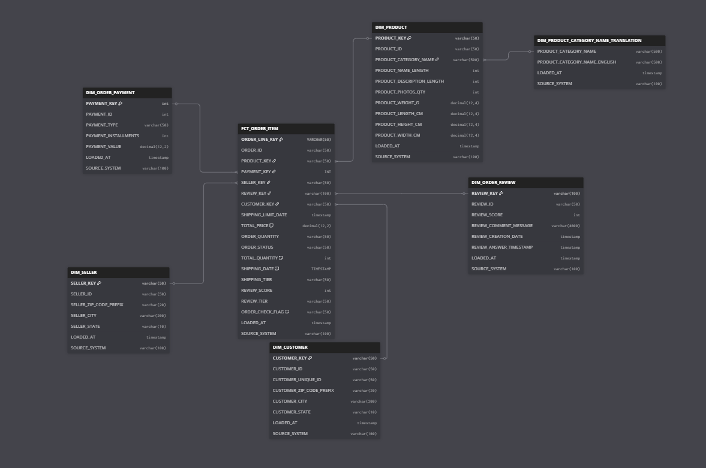

# Data Modeling Methodology

## Overview

This project implements a **Dimensional Modeling** approach using the **Star Schema** design pattern to organize the Brazilian E-commerce dataset. This methodology was chosen to optimize analytical query performance and provide an intuitive structure for business intelligence reporting.

---

## Methodology: Dimensional Modeling (Star Schema)

### What is Dimensional Modeling?

Dimensional modeling is a data modeling technique optimized for data warehousing and business intelligence. It organizes data into:

- **Fact Tables**: Contain measurable, quantitative data (metrics/KPIs)
- **Dimension Tables**: Contain descriptive attributes that provide context to facts

### Why Star Schema?

The star schema was selected for this project due to its:

1. **Query Performance**: Simple joins between fact and dimension tables result in faster query execution
2. **Simplicity**: Easy to understand structure for both technical and business users
3. **Scalability**: Efficiently handles large volumes of transactional data
4. **BI Tool Compatibility**: Native support in tools like Tableau, Power BI, and Looker
5. **Maintainability**: Clear separation of facts and dimensions simplifies updates

---

## Data Model Architecture

### Fact Table: `FACT_ORDERS`

**Grain**: One row per order

**Purpose**: Central table containing order transactions and associated metrics

**Key Measures**:
- `order_qty`: Quantity of items in the order
- `total_order_value`: Total monetary value of the order
- `shipping_date`: Days from purchase to shipping
- `shipping_sla_days`: Shipping SLA in days
- `delivered_after_sla_days`: Days delivered after SLA deadline
- `review_score`: Customer satisfaction rating (1-5)

**Foreign Keys (Surrogate Keys)**:
- `customer_key` → Links to DIM_CUSTOMER
- `seller_key` → Links to DIM_SELLER
- `product_key` → Links to DIM_PRODUCT
- `order_payment_key` → Links to DIM_ORDER_PAYMENT
- `order_review_key` → Links to DIM_ORDER_REVIEW

**Natural Keys** (for traceability):
- `order_id`
- `customer_id`
- `seller_id`
- `product_id`

**Derived Metrics** (calculated via macros):
- `shipping_tier`: Performance categorization (Express, Fast, Standard, Delayed, etc.)
- `review_tier`: Customer satisfaction tier (Promoter, Passive, Detractor, Not Reviewed)

---

### Dimension Tables

#### 1. **DIM_CUSTOMER** (SCD Type 2)
**Purpose**: Customer demographic and geographic information with historical tracking

**Key Attributes**:
- `customer_key` (Surrogate Key - PK)
- `customer_id` (Natural Key)
- `customer_unique_id`: Business identifier for the same person across multiple accounts
- `customer_zip_code_prefix`: Geographic location prefix
- `customer_city`: City name
- `customer_state`: State code

**SCD Type 2 Implementation**:
- `effective_from`: Timestamp when the customer version became active
- `effective_to`: Timestamp when the customer version expired (NULL for current)
- `is_current`: Boolean flag indicating current record

---

#### 2. **DIM_SELLER**
**Purpose**: Seller location and identification information

**Key Attributes**:
- `seller_key` (Surrogate Key - PK)
- `seller_id` (Natural Key)
- `seller_zip_code_prefix`: Seller geographic location
- `seller_city`: City where seller operates
- `seller_state`: State code

---

#### 3. **DIM_PRODUCT**
**Purpose**: Product catalog information with multilingual support

**Key Attributes**:
- `product_key` (Surrogate Key - PK)
- `product_id` (Natural Key)
- `product_category_name`: Original Portuguese category name
- `product_category_english`: Translated English category name
- `product_name_length`: Length of product name (data quality indicator)
- `product_description_length`: Length of product description
- `product_photos_qty`: Number of product photos
- `product_weight_g`: Product weight in grams
- `product_length_cm`, `product_height_cm`, `product_width_cm`: Product dimensions


---

#### 4. **DIM_ORDER_PAYMENT**
**Purpose**: Order payment details and installment information

**Key Attributes**:
- `order_payment_key` (Surrogate Key - PK)
- `order_id` (Natural Key)
- `payment_type`: Payment method (credit card, debit, voucher, etc.)
- `payment_installments`: Number of installments
- `payment_value`: Total payment amount

---

#### 5. **DIM_ORDER_REVIEW**
**Purpose**: Customer feedback and review information

**Key Attributes**:
- `order_review_key` (Surrogate Key - PK)
- `review_id` (Natural Key)
- `order_id`: Links to fact table
- `review_score`: Rating (1-5)
- `review_comment_message`: Customer feedback text
- `review_creation_date`: When review was created
- `review_answer_timestamp`: When seller responded


---

#### 6. **DIM_PRODUCT_CATEGORY_NAME_TRANSLATION**
**Purpose**: Lookup table for product category translations

**Key Attributes**:
- `product_category_name`: Portuguese category name (PK)
- `product_category_name_english`: English translation

---

## Schema Design Diagram

The following diagram illustrates the star schema implementation with **FACT_ORDERS** at the center, surrounded by six dimension tables:



---

## Design Decisions & Rationale

### 1. **Surrogate Keys vs Natural Keys**

**Decision**: Use surrogate keys as primary keys in all dimension tables

**Rationale**:
- **Performance**: Integer surrogate keys (MD5 hash) are faster for joins than composite natural keys
- **SCD Support**: Enables tracking multiple versions of the same natural key (e.g., customer moving addresses)
- **Stability**: Natural keys may change; surrogate keys remain stable
- **Consistency**: Uniform key structure across all tables

**Implementation**:
```sql
{{ dbt_utils.generate_surrogate_key(['customer_id', 'effective_from']) }} as customer_key
```

---

### 2. **SCD Type 2 for DIM_CUSTOMER**

**Decision**: Implement Slowly Changing Dimension Type 2 for customer dimension

**Rationale**:
- **Historical Accuracy**: Captures customer address at the time of order (e.g., "Customer lived in São Paulo when they ordered, now in Rio")
- **Migration Analysis**: Enables tracking customer relocation patterns
- **Point-in-Time Reporting**: Supports "as-was" queries for regulatory compliance

**Trade-offs**:
- Increased storage (multiple rows per customer)
- More complex joins (temporal filtering required)
- Worth it for analytical depth

**Implementation**:
- Snapshot strategy using dbt snapshots
- `effective_from`/`effective_to` timestamp columns
- `is_current` flag for active records
- Temporal join in fact table:
```sql
LEFT JOIN dim_customers c
  ON o.customer_id = c.customer_id
  AND (
      (o.order_purchase_timestamp >= c.effective_from 
       AND o.order_purchase_timestamp < c.effective_to)
      OR (o.order_purchase_timestamp < c.effective_from 
          AND c.effective_to IS NULL)  -- Fallback to current for historical orders
  )
```

---


### 3. **Derived Metrics via dbt Macros**

**Decision**: Calculate categorical tiers (shipping_tier, review_tier) at transformation time rather than in BI tools

**Rationale**:
- **Consistency**: Single source of truth for business logic
- **Performance**: Pre-computed values faster than runtime calculations
- **Reusability**: Macros can be used across multiple models
- **Testability**: Can write automated tests for tier logic

**Example Macro**:
```sql

    CASE
        WHEN {{ shipping_date }} IS NULL THEN 'Not Shipped'
        WHEN {{ shipping_date }} <= 3 THEN 'Excellent'
        WHEN {{ shipping_date }} <= 7 THEN 'Good'
        WHEN {{ shipping_date }} <= 15 THEN 'Average'
        WHEN {{ shipping_date }} <= 30 THEN 'Below Average'
        ELSE 'Poor'
    END

```

---


## Data Quality & Testing

### Testing Strategy

**Source Tests** (`_sources.yml`):
- Uniqueness of natural keys
- Referential integrity between raw tables
- Not-null constraints on critical fields

**Model Tests** (`fact_orders.yml`, dimension YML files):
- Surrogate key uniqueness
- Foreign key relationships to dimensions
- Accepted values for categorical columns
- Range tests for numeric measures

**Custom Tests**:
- Macro logic validation (e.g., tier boundaries)
- Temporal join accuracy for SCD Type 2
- Incremental logic correctness

