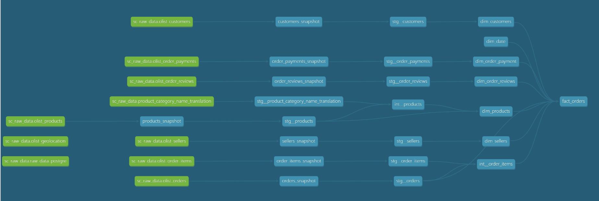

# Data Transformation Architecture

This document describes the data transformation architecture used in this project, following the **Medallion Architecture** pattern with an additional **Snapshot** layer for change data capture (CDC).



---

## Architecture Overview

```
┌─────────────────────────────────────────────────────────────────────────────────────────┐
│                              DATA TRANSFORMATION PIPELINE                                │
├─────────────────────────────────────────────────────────────────────────────────────────┤
│                                                                                         │
│   ┌──────────┐    ┌───────────┐    ┌───────────┐    ┌──────────────┐    ┌───────────┐  │
│   │  SOURCE  │───▶│ SNAPSHOT  │───▶│  STAGING  │───▶│ INTERMEDIATE │───▶│ ANALYTICS │  │
│   │  (Raw)   │    │  (SCD2)   │    │  (Bronze) │    │   (Silver)   │    │  (Gold)   │  │
│   └──────────┘    └───────────┘    └───────────┘    └──────────────┘    └───────────┘  │
│                                                                                         │
│   • Postgres       • CDC tracking   • Type casting   • Business logic   • Dim/Fact     │
│   • External       • SCD Type 2     • Renaming       • Derived attrs    • Star schema  │
│   • APIs           • History        • Cleaning       • Joins            • KPIs         │
│                                                                                         │
└─────────────────────────────────────────────────────────────────────────────────────────┘
```

---

## Medallion Architecture

The **Medallion Architecture** (Bronze → Silver → Gold) is a data design pattern used to logically organize data in a lakehouse. Each layer represents a progressively refined and enriched version of the data.

| Layer | Alias | Purpose | Quality |
|-------|-------|---------|---------|
| **Source** | Raw | Original data from source systems | Unprocessed |
| **Snapshot** | CDC | Change data capture with SCD Type 2 | Versioned |
| **Staging** | Bronze | Type casting, light transformation | Cleaned |
| **Intermediate** | Silver | Business transformation, derived attributes | Enriched |
| **Analytics** | Gold | Dimensional models, star/snowflake schema | Consumption-ready |

---

## Layer Details

### 1. Source Layer (Raw Data)

Raw data ingested from source systems without transformation.

**Sources in this project:**
- `sc_raw_data.olist_customers` — Customer information
- `sc_raw_data.olist_orders` — Order headers
- `sc_raw_data.olist_order_items` — Order line items
- `sc_raw_data.olist_order_payments` — Payment transactions
- `sc_raw_data.olist_order_reviews` — Customer reviews
- `sc_raw_data.olist_products` — Product catalog
- `sc_raw_data.olist_sellers` — Seller information
- `sc_raw_data.olist_geolocation` — Geographic data
- `sc_raw_data.product_category_name_translation` — Category translations

📁 See: [snapshots/README.md](./snapshots/snapshot.md)

---

### 2. Snapshot Layer (Change Data Capture)

Captures historical changes using **dbt snapshots** with **SCD Type 2** strategy.

**Purpose:**
- Track changes to slowly changing dimensions
- Maintain full history of record changes
- Enable point-in-time analysis

**Snapshot tables:**
| Snapshot | Source | Strategy |
|----------|--------|----------|
| `customers_snapshot` | `olist_customers` | `check` |
| `orders_snapshot` | `olist_orders` | `check` |
| `order_items_snapshot` | `olist_order_items` | `check` |
| `order_payments_snapshot` | `olist_order_payments` | `check` |
| `order_reviews_snapshot` | `olist_order_reviews` | `check` |
| `products_snapshot` | `olist_products` | `check` |
| `sellers_snapshot` | `olist_sellers` | `check` |

📁 See: [snapshots/README.md](./snapshots/snapshot.md)

---

### 3. Staging Layer (Bronze)

Light transformations to clean and standardize raw data.

**Transformations:**
- ✅ Type casting (strings → dates, integers, decimals)
- ✅ Column renaming (snake_case standardization)
- ✅ Null handling and default values
- ✅ Basic data cleaning (trimming, lowercasing)
- ❌ No business logic
- ❌ No joins between tables

**Staging models:**
| Model | Source | Description |
|-------|--------|-------------|
| `stg__customers` | `customers_snapshot` | Customer dimension base |
| `stg__orders` | `orders_snapshot` | Order header base |
| `stg__order_items` | `order_items_snapshot` | Order line items base |
| `stg__order_payments` | `order_payments_snapshot` | Payment transactions base |
| `stg__order_reviews` | `order_reviews_snapshot` | Review data base |
| `stg__products` | `products_snapshot` | Product catalog base |
| `stg__sellers` | `sellers_snapshot` | Seller data base |
| `stg__product_category_name_translation` | `product_category_name_translation` | Category translations |

📁 See: [staging/README.md](./staging/staging.md)

---

### 4. Intermediate Layer (Silver)

Business transformations to create derived attributes and prepare data for analytics.

**Transformations:**
- ✅ Business logic implementation
- ✅ Derived/calculated columns
- ✅ Joins between staging tables
- ✅ Aggregations and groupings
- ✅ Data enrichment
- ❌ Not exposed to end users

**Intermediate models:**
| Model | Description |
|-------|-------------|
| `int__products` | Products enriched with translated category names |
| `int__order_items` | Order items with product and seller context |

📁 See: [intermediate/README.md](./intermediate/intermediate.md)

---

### 5. Analytics Layer (Gold)

Final dimensional models optimized for BI tools and analytics.

**Schema Type:** ⭐ **Star Schema**

**Transformations:**
- ✅ Dimensional modeling (Kimball methodology)
- ✅ Surrogate key generation
- ✅ Fact/dimension table separation
- ✅ Pre-aggregated metrics
- ✅ Optimized for query performance

**Dimension tables:**
| Model | Description | Grain |
|-------|-------------|-------|
| `dim_customers` | Customer dimension with geography | 1 row per customer |
| `dim_products` | Product dimension with categories | 1 row per product |
| `dim_sellers` | Seller dimension with location | 1 row per seller |
| `dim_date` | Date dimension (calendar) | 1 row per date |
| `dim_order_payment` | Payment method dimension | 1 row per payment |
| `dim_order_reviews` | Review dimension with scores | 1 row per review |

**Fact tables:**
| Model | Description | Grain |
|-------|-------------|-------|
| `fact_orders` | Order fact with all foreign keys | 1 row per order item |

📁 See: [analytics/README.md](./analytics/analytics.md)

---

## Data Lineage

The diagram below shows the complete data lineage from source to analytics:

```
SOURCE (Green)              SNAPSHOT (Gray)           STAGING (Blue)         INTERMEDIATE    ANALYTICS (Blue)
─────────────────────────────────────────────────────────────────────────────────────────────────────────────

olist_customers ──────────▶ customers_snapshot ─────▶ stg__customers ──────────────────────▶ dim_customers
                                                                                                    │
olist_order_payments ─────▶ order_payments_snapshot ▶ stg__order_payments ─────────────────▶ dim_order_payment
                                                                                                    │
olist_order_reviews ──────▶ order_reviews_snapshot ─▶ stg__order_reviews ──────────────────▶ dim_order_reviews
                                                                                                    │
product_category_translation ────────────────────────▶ stg__product_category ─┐                     │
                                                                              │                     │
olist_products ───────────▶ products_snapshot ──────▶ stg__products ──────────┴▶ int__products ──▶ dim_products
                                                                                                    │
olist_sellers ────────────▶ sellers_snapshot ───────▶ stg__sellers ────────────────────────▶ dim_sellers
                                                                                                    │
                                                                                              dim_date ◀── (generated)
                                                                                                    │
olist_orders ─────────────▶ orders_snapshot ────────▶ stg__orders ─────────────────────────────────┼────────┐
                                                                                                    │        │
olist_order_items ────────▶ order_items_snapshot ───▶ stg__order_items ────▶ int__order_items ─────┴──▶ fact_orders
```

---

## Folder Structure

```
docs/data-transformation/
├── dbt-transformation.md              # This file (architecture overview)
├── dbt-lineage.png        # dbt lineage graph screenshot
├── snapshots/
│   └── snapshot.md          # Snapshot layer documentation
├── staging/
│   └── staging.md          # Staging layer documentation
├── intermediate/
│   └── intermediate.md          # Intermediate layer documentation
└── analytics/
    └── analytics.md          # Analytics layer documentation
```

---

## References

- [dbt Medallion Architecture](https://www.getdbt.com/blog/medallion-architecture)
- [Kimball Dimensional Modeling](https://www.kimballgroup.com/data-warehouse-business-intelligence-resources/kimball-techniques/dimensional-modeling-techniques/)
- [dbt Snapshots Documentation](https://docs.getdbt.com/docs/build/snapshots)

---

*Last updated: December 2025*
